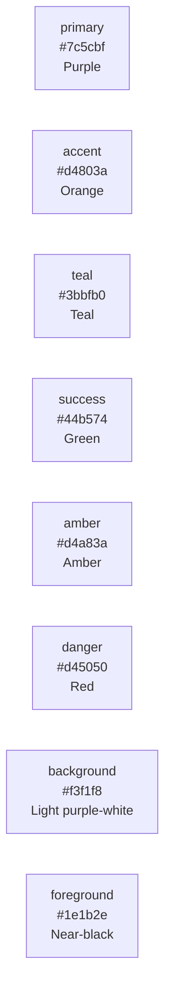
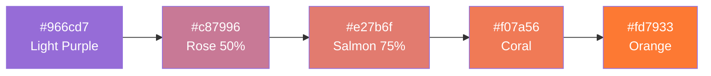
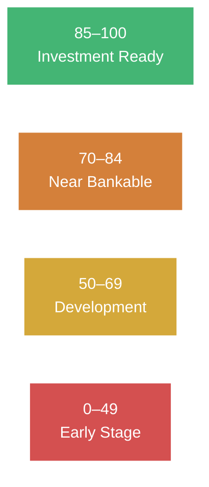
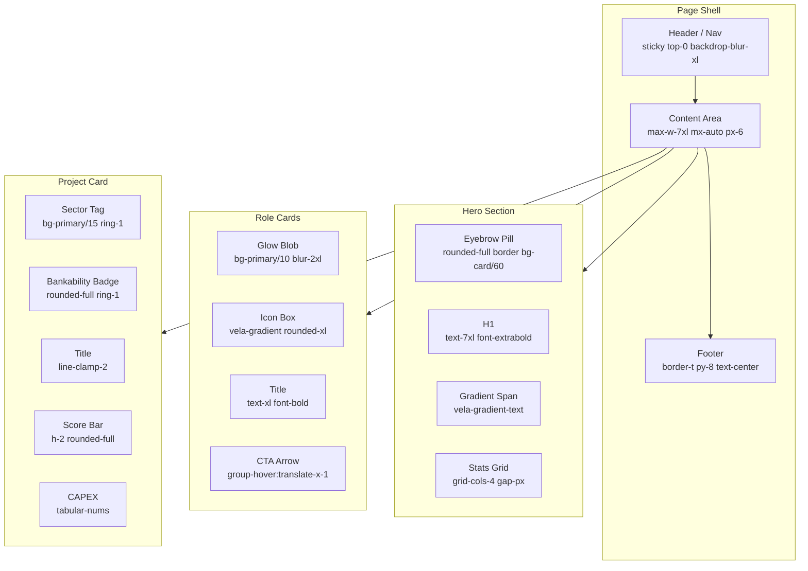

# VELA Design System

> Design reference extracted from https://invest-vela-id.lovable.app  
> Stack: React + Tailwind CSS v4 · Inter font · Lucide icons · Radix UI primitives

---

## Design Philosophy

- **Dark-adjacent light** — background is a very light purple-tinted white, not neutral grey
- **Translucency layering** — cards use `bg-card/60` with `backdrop-blur`, headers use `bg-background/70`
- **Purple-to-orange gradient** as the single brand accent — applied to logo, hero headline, stat numbers, CTA icons
- **Glassmorphic surfaces** — borders at `border-border/60`, subtle `bg-card/60` for cards
- **Score-driven color** — bankability tiers drive green/orange/amber/red semantically, not decoratively

---

## Color Tokens

All colors defined as CSS custom properties on `:root`, using **OKLCH color space** (Tailwind CSS v4).

### Core Palette

| Token | OKLCH | Approx Hex | Usage |
|-------|-------|------------|-------|
| `--background` | `oklch(96.5% .02 300)` | `#f3f1f8` | Page background |
| `--foreground` | `oklch(22% .05 285)` | `#1e1b2e` | Primary text |
| `--card` | `oklch(99% .01 300)` | `#fefeff` | Card surface |
| `--card-foreground` | `oklch(22% .05 285)` | `#1e1b2e` | Card text |
| `--popover` | `oklch(99% .01 300)` | `#fefeff` | Popover background |
| `--popover-foreground` | `oklch(22% .05 285)` | `#1e1b2e` | Popover text |
| `--border` | `oklch(88% .04 300)` | `#ddd7ec` | Borders, dividers |
| `--input` | `oklch(92% .035 300)` | `#e8e3f4` | Input backgrounds |
| `--muted` | `oklch(94% .025 300)` | `#ede9f5` | Muted surfaces |
| `--muted-foreground` | `oklch(48% .05 285)` | `#6b6480` | Secondary / hint text |

### Brand Colors

| Token | OKLCH | Approx Hex | Usage |
|-------|-------|------------|-------|
| `--primary` | `oklch(55% .13 300)` | `#7c5cbf` | Purple — CTAs, active nav, focus rings |
| `--primary-foreground` | `oklch(99% .005 250)` | `#fafaff` | Text on primary |
| `--secondary` | `oklch(93% .035 300)` | `#ebe6f5` | Subtle hover backgrounds |
| `--secondary-foreground` | `oklch(28% .06 285)` | `#2d2542` | Text on secondary |
| `--accent` | `oklch(68% .18 45)` | `#d4803a` | Orange — "The Problem" label, Near Bankable tier |
| `--accent-foreground` | `oklch(15% .02 270)` | `#1a1825` | Text on accent |
| `--teal` | `oklch(72% .12 180)` | `#3bbfb0` | "The VELA Solution" label, solution icons, live dot |
| `--ring` | `oklch(55% .13 300)` | `#7c5cbf` | Focus ring (same as primary) |

### Semantic Colors (Score / Status)

| Token | OKLCH | Approx Hex | Usage |
|-------|-------|------------|-------|
| `--success` | `oklch(70% .18 150)` | `#44b574` | Investment Ready tier (85–100) |
| `--amber` | `oklch(78% .16 80)` | `#d4a83a` | Development tier (50–69) |
| `--warning` | `oklch(72% .17 60)` | `#d4b030` | Warning states |
| `--danger` | `oklch(62% .22 25)` | `#d45050` | Early Stage tier (<50), destructive |
| `--destructive` | `oklch(60% .22 25)` | `#cc4848` | Error / destructive actions |

### Chart Tokens

| Token | Maps to |
|-------|---------|
| `--chart-1` | `oklch(70% .18 150)` — green (success) |
| `--chart-2` | `oklch(68% .18 45)` — orange (accent) |
| `--chart-3` | `oklch(78% .16 80)` — amber |
| `--chart-4` | `oklch(62% .22 25)` — red (danger) |
| `--chart-5` | `oklch(55% .13 300)` — purple (primary) |



---

## Gradient System

The VELA brand gradient is the primary visual identity element — purple → pink → coral → orange.

### `.vela-gradient` (background gradient)
Applied to: logo icon, role card icons, any solid fill surfaces

```css
.vela-gradient {
  background-image: linear-gradient(135deg,
    #7e5db1,          /* purple */
    #b56b7d 50%,      /* mauve/pink */
    #d26d5c 75%,      /* coral */
    #e06d45,          /* warm orange */
    #ef6c22           /* amber orange */
  );
}
```

### `.vela-gradient-text` (text gradient)
Applied to: "Faster Decisions." headline, stat numbers, logo wordmark

```css
.vela-gradient-text {
  color: transparent;
  background-image: linear-gradient(135deg,
    #966cd7,          /* light purple */
    #c87996 50%,      /* rose */
    #e27b6f 75%,      /* salmon */
    #f07a56,          /* coral */
    #fd7933           /* orange */
  );
  -webkit-background-clip: text;
  background-clip: text;
}
```



---

## Bankability Tier Color System

Score-to-color mapping is consistent across all components (badges, progress bars, score numbers).

| Score | Tier | Text token | Background | Ring | Progress bar color |
|-------|------|-----------|------------|------|--------------------|
| 85–100 | Investment Ready | `text-success` | `bg-success/15` | `ring-success/40` | `var(--success)` |
| 70–84 | Near Bankable | `text-accent` | `bg-accent/15` | `ring-accent/40` | `var(--accent)` |
| 50–69 | Development | `text-amber` | `bg-amber/15` | `ring-amber/40` | `var(--amber)` |
| 0–49 | Early Stage | `text-danger` | `bg-danger/15` | `ring-danger/40` | `var(--danger)` |



### Score Color Function (JS)

```js
function getScoreColor(score) {
  if (score >= 85) return 'var(--success)'   // green
  if (score >= 70) return 'var(--accent)'    // orange
  if (score >= 50) return 'var(--amber)'     // amber
  return 'var(--danger)'                     // red
}

function getBankabilityBand(score) {
  if (score >= 85) return { label: 'Investment Ready', key: 'ready',  color: 'text-success', bg: 'bg-success/15', ring: 'ring-success/40' }
  if (score >= 70) return { label: 'Near Bankable',    key: 'near',   color: 'text-accent',  bg: 'bg-accent/15',  ring: 'ring-accent/40'  }
  if (score >= 50) return { label: 'Development',      key: 'dev',    color: 'text-amber',   bg: 'bg-amber/15',   ring: 'ring-amber/40'   }
  return                { label: 'Early Stage',       key: 'early',  color: 'text-danger',  bg: 'bg-danger/15',  ring: 'ring-danger/40'  }
}
```

---

## Typography

**Font:** Inter (Google Fonts) — weights 400, 500, 600, 700, 800

```css
font-family: 'Inter', ui-sans-serif, system-ui, sans-serif;
```

### Type Scale

| Token | rem | px | Usage |
|-------|-----|----|-------|
| `text-xs` | 0.75rem | 12px | Labels, meta, tracking tags |
| `text-sm` | 0.875rem | 14px | Body small, nav items, badges |
| `text-base` | 1rem | 16px | Body default |
| `text-lg` | 1.125rem | 18px | Lead text, hero subtitle |
| `text-xl` | 1.25rem | 20px | Card titles |
| `text-2xl` | 1.5rem | 24px | Logo wordmark |
| `text-3xl` | 1.875rem | 30px | Section headings |
| `text-4xl` | 2.25rem | 36px | Stat values (mobile) |
| `text-5xl` | 3rem | 48px | Hero H1 (mobile) |
| `text-7xl` | 4.5rem | 72px | Hero H1 (desktop) |

### Typography Patterns

| Role | Classes |
|------|---------|
| Hero H1 | `text-5xl md:text-7xl font-extrabold tracking-tight leading-[1.05]` |
| Hero gradient span | `vela-gradient-text` |
| Section heading | `text-3xl md:text-4xl font-bold` |
| Card title | `text-xl font-bold` |
| Card body | `text-sm text-muted-foreground leading-relaxed` |
| Stat number | `text-3xl md:text-4xl font-extrabold vela-gradient-text tabular-nums` |
| Section label | `text-xs uppercase tracking-[0.2em] font-semibold` |
| Nav item | `text-sm font-medium` |
| Badge small | `text-xs font-semibold` |
| Badge large | `text-sm font-semibold` |
| Sector tag | `text-[11px] font-semibold uppercase tracking-wider` |
| Meta / hint | `text-xs text-muted-foreground` |
| Logo text | `text-2xl font-bold tracking-tight lowercase vela-gradient-text` |

---

## Spacing & Layout

- **Base unit:** `--spacing: 0.25rem` (4px)
- **Max content width:** `max-w-7xl` (80rem / 1280px)
- **Horizontal padding:** `px-6` (24px)
- **Section vertical padding:** `py-20` (80px)
- **Nav height:** `h-16` (64px)

### Breakpoints (Tailwind defaults)

| Prefix | Min-width |
|--------|-----------|
| `sm` | 640px |
| `md` | 768px |
| `lg` | 1024px |
| `xl` | 1280px |

### Grid Patterns

| Pattern | Classes |
|---------|---------|
| Stats row | `grid grid-cols-2 md:grid-cols-4 gap-px` |
| Role cards | `grid md:grid-cols-3 gap-5` |
| Projects | `grid sm:grid-cols-2 lg:grid-cols-3 gap-4` |
| Dashboard panel | `grid md:grid-cols-12 gap-3` |
| Problem/Solution | `grid md:grid-cols-2 gap-12` |

---

## Border Radius

| Token | Value | Usage |
|-------|-------|-------|
| `--radius` | `0.625rem` (10px) | Default — inputs, dropdowns, small cards |
| `--radius-2xl` | `1rem` (16px) | Larger cards, stats grid container |
| `rounded-xl` | `0.75rem` (12px) | Project cards, icon containers |
| `rounded-2xl` | `1rem` (16px) | Role cards, stats wrapper |
| `rounded-full` | `9999px` | Badges, pills, dots, avatar-style icons |
| `rounded-md` | `0.375rem` (6px) | Buttons, sector tags, filter selects |
| `rounded-lg` | `0.5rem` (8px) | Logo icon container |

---

## Elevation & Shadow

| Class | Usage |
|-------|-------|
| `shadow-lg shadow-primary/30` | Logo icon |
| `hover:shadow-lg hover:shadow-primary/10` | Project card hover |
| `hover:shadow-2xl hover:shadow-primary/20` | Role card hover |
| `shadow-sm` | Textarea, small inputs |

Shadows always use `shadow-primary/N` (purple-tinted) — never neutral grey box shadows.

---

## Motion & Transitions

| Pattern | Classes |
|---------|---------|
| Default transition | `transition-colors` |
| Card lift | `transition-all hover:-translate-y-1` |
| Glow pulse | `absolute ... bg-primary/10 blur-2xl group-hover:bg-primary/20 transition` |
| Nav arrow | `transition-transform group-hover:translate-x-1` |
| Card corner link | `transition-transform group-hover:-translate-y-0.5 group-hover:translate-x-0.5` |
| Score bar fill | `transition-all` (width animation) |

Keyframe animations defined:
- `pulse` — opacity 0.5 at 50%
- `enter` / `exit` — toast / sheet enter/exit
- `accordion-down` / `accordion-up` — height 0 ↔ full
- `caret-blink` — text cursor blink

---

## Components

### Navigation / Header

```
sticky top-0 z-40 backdrop-blur-xl bg-background/70 border-b border-border/50
```

Inner container: `mx-auto max-w-7xl px-6 h-16 flex items-center justify-between`

**Nav link states:**

| State | Classes |
|-------|---------|
| Active | `bg-primary/15 text-foreground` |
| Default | `text-muted-foreground hover:text-foreground hover:bg-secondary/60` |
| Base (both) | `px-3 py-2 rounded-md text-sm font-medium flex items-center gap-2 transition-colors` |

---

### Logo

```html
<!-- Icon container -->
<div class="relative flex items-center justify-center rounded-lg vela-gradient shadow-lg shadow-primary/30">
  <!-- icon size varies: w-8 h-8 / w-10 h-10 -->
</div>
<!-- Wordmark -->
<span class="text-2xl font-bold tracking-tight lowercase vela-gradient-text">vela</span>
```

---

### Status Pill (header badge)

```html
<span class="hidden sm:inline-flex items-center gap-2 px-3 py-1.5 rounded-full
             text-xs font-semibold bg-primary/15 text-foreground ring-1 ring-primary/30">
  <span class="w-1.5 h-1.5 rounded-full bg-teal"></span>
  Live
</span>
```

---

### Hero Section

```html
<!-- Background effects -->
<div class="absolute inset-0 grid-bg opacity-40"></div>
<div class="absolute inset-0 bg-gradient-to-b from-transparent via-background/30 to-background"></div>
<div class="absolute -top-40 left-1/2 -translate-x-1/2 w-[900px] h-[900px]
            rounded-full bg-primary/20 blur-3xl"></div>

<!-- Content -->
<div class="relative mx-auto max-w-7xl px-6 pt-20 pb-24 lg:pt-28 lg:pb-32">

  <!-- Eyebrow pill -->
  <div class="inline-flex items-center gap-2 rounded-full border border-border/60
              bg-card/60 px-3 py-1 text-xs text-muted-foreground backdrop-blur">
    Built for BKPM · Powered by AI bankability scoring
  </div>

  <!-- H1 -->
  <h1 class="mt-6 max-w-4xl text-5xl md:text-7xl font-extrabold tracking-tight leading-[1.05]">
    Smarter Investments.<br/>
    <span class="vela-gradient-text">Faster Decisions.</span>
  </h1>

  <!-- Subtitle -->
  <p class="mt-6 max-w-2xl text-lg text-muted-foreground">...</p>
</div>
```

---

### Stats Grid

```html
<div class="mt-12 grid grid-cols-2 md:grid-cols-4 gap-px overflow-hidden
            rounded-2xl border border-border/60 bg-border/60">
  <div class="bg-card/80 px-6 py-6 backdrop-blur">
    <div class="text-3xl md:text-4xl font-extrabold vela-gradient-text tabular-nums">247</div>
    <div class="mt-1 text-xs uppercase tracking-wider text-muted-foreground">Projects tracked</div>
  </div>
  <!-- repeat for each stat -->
</div>
```

The `gap-px bg-border/60` pattern creates hairline dividers between cells without explicit `<hr>` elements.

---

### Role Selection Cards

```html
<button class="group text-left relative overflow-hidden rounded-2xl border border-border/60
               bg-card/60 p-6 transition-all
               hover:border-primary/60 hover:bg-card hover:-translate-y-1
               hover:shadow-2xl hover:shadow-primary/20">

  <!-- Glow blob -->
  <div class="absolute -top-12 -right-12 w-40 h-40 rounded-full
              bg-primary/10 blur-2xl group-hover:bg-primary/20 transition"></div>

  <div class="relative">
    <!-- Icon -->
    <div class="inline-flex items-center justify-center w-12 h-12 rounded-xl vela-gradient">
      <Icon class="text-white" size=22 strokeWidth=2.2 />
    </div>

    <h3 class="mt-5 text-xl font-bold">Investor</h3>
    <p class="mt-2 text-sm text-muted-foreground leading-relaxed">...</p>

    <!-- CTA link -->
    <div class="mt-6 inline-flex items-center gap-1 text-sm font-semibold text-foreground/90">
      Continue <ArrowRight size=14 class="transition-transform group-hover:translate-x-1" />
    </div>
  </div>
</button>
```

---

### Section Label

```html
<!-- Problem label (orange) -->
<div class="text-xs uppercase tracking-[0.2em] text-accent font-semibold">The Problem</div>

<!-- Solution label (teal) -->
<div class="text-xs uppercase tracking-[0.2em] text-teal font-semibold">The VELA Solution</div>
```

Pattern: `text-xs uppercase tracking-[0.2em] text-{color} font-semibold`

---

### Project Card

```html
<a class="group relative flex flex-col gap-4 rounded-xl border border-border/60
          bg-card/60 p-5 transition-all
          hover:border-primary/50 hover:bg-card hover:shadow-lg hover:shadow-primary/10">

  <!-- Header row -->
  <div class="flex items-start justify-between gap-3">
    <!-- Sector tag -->
    <span class="rounded-md bg-primary/15 text-primary-foreground/90 px-2 py-0.5
                 text-[11px] font-semibold uppercase tracking-wider ring-1 ring-primary/30">
      Renewable Energy
    </span>
    <!-- Bankability badge (see below) -->
  </div>

  <!-- Project title -->
  <span class="text-base font-semibold leading-snug text-foreground line-clamp-2">
    North Java Solar Farm
  </span>

  <!-- Footer row -->
  <div class="flex items-center justify-between border-t border-border/50 pt-3">
    <!-- Location -->
    <span class="inline-flex items-center gap-1 text-xs text-muted-foreground">
      <MapPin size=12 /> Java
    </span>
    <!-- CAPEX -->
    <span class="text-sm font-semibold text-foreground tabular-nums">$420M</span>
  </div>
</a>
```

---

### Bankability Badge

```html
<!-- Small (default, e.g. on project cards) -->
<span class="inline-flex items-center gap-1.5 rounded-full font-semibold ring-1
             px-2.5 py-0.5 text-xs
             {band.bg} {band.color} {band.ring}">
  <span class="w-1.5 h-1.5 rounded-full" style="background: scoreColor(score)"></span>
  Investment Ready
</span>

<!-- Large (e.g. on project detail) -->
<span class="inline-flex items-center gap-1.5 rounded-full font-semibold ring-1
             px-3 py-1 text-sm
             {band.bg} {band.color} {band.ring}">
```

Tier → classes map:

| Tier | `.bg` | `.color` | `.ring` |
|------|-------|----------|---------|
| Investment Ready | `bg-success/15` | `text-success` | `ring-success/40` |
| Near Bankable | `bg-accent/15` | `text-accent` | `ring-accent/40` |
| Development | `bg-amber/15` | `text-amber` | `ring-amber/40` |
| Early Stage | `bg-danger/15` | `text-danger` | `ring-danger/40` |

---

### Score Progress Bar

```html
<!-- Track -->
<div class="h-2 rounded-full bg-secondary/80 overflow-hidden ring-1 ring-border/60">
  <!-- Fill -->
  <div class="h-full rounded-full transition-all"
       style="width: {score}%; background: {scoreColor(score)}">
  </div>
</div>
```

---

### Score Number

```html
<span class="font-bold tabular-nums" style="color: {scoreColor(score)}">
  85
</span>
```

---

### Buttons

**Primary:**
```html
<button class="inline-flex items-center justify-center rounded-md
               bg-primary px-4 py-2
               text-sm font-medium text-primary-foreground
               transition-colors hover:bg-primary/90">
  Submit Project
</button>
```

**Ghost / Outline:**
```html
<button class="inline-flex items-center justify-center rounded-md
               border border-input bg-background px-4 py-2
               text-sm font-medium text-foreground
               transition-colors hover:bg-accent">
  Or explore as an investor →
</button>
```

**Ghost (text only):**
```html
<button class="...variant-ghost...">
  Cancel
</button>
```

---

### Filter Select

```html
<select class="h-10 rounded-md border border-border bg-input/60 px-3
               text-sm text-foreground
               focus:outline-none focus:ring-2 focus:ring-ring">
  <option>All sectors</option>
</select>
```

With search icon variant:
```html
<div class="relative">
  <SearchIcon class="absolute left-3 top-1/2 -translate-y-1/2 text-muted-foreground" size=16 />
  <input class="h-10 rounded-md border border-border bg-input/60 pl-9 pr-3 ..." />
</div>
```

---

### Textarea

```html
<textarea class="flex min-h-[60px] w-full rounded-md border border-input bg-transparent
                 px-3 py-2 text-base shadow-sm
                 placeholder:text-muted-foreground
                 focus-visible:outline-none focus-visible:ring-1 focus-visible:ring-ring
                 disabled:cursor-not-allowed disabled:opacity-50
                 md:text-sm">
</textarea>
```

---

### Empty State

```html
<div class="mt-12 rounded-xl border border-dashed border-border p-12 text-center text-muted-foreground">
  No projects match your filters.
</div>
```

---

### Backdrop Panel (dashboard widget)

```html
<div class="rounded-2xl border border-border/60 bg-card/60 p-4">
  ...
</div>
```

---

### Footer

```html
<footer class="border-t border-border/50 py-8 text-center text-xs text-muted-foreground">
  © 2026 VELA · Indonesia Investment Intelligence Platform · Demo build
</footer>
```

---

## Iconography

Library: **Lucide React** (tree-shakeable SVG icons)

Icons used in the prototype:

| Icon | Usage |
|------|-------|
| `Sparkles` | AI features label (eyebrow), solution list |
| `TrendingUp` | Investor role card |
| `Building2` | Developer role card |
| `ShieldCheck` | BKPM Admin role card |
| `ArrowRight` | CTA chevron |
| `ArrowUpRight` | External project link |
| `Funnel` | Filter panel |
| `Search` | Search input |
| `MapPin` | Province location on project card |
| `ChartColumn` | Dashboard / analytics |
| `FileSearch` | Document extraction |
| `FileCheckCorner` | Document checklist items |
| `DollarSign` | CAPEX / investment value |

Standard size: `size={18}` with `strokeWidth={2}` for body icons, `size={22} strokeWidth={2.2}` for role card hero icons.

---

## Spacing Cheatsheet

Based on Tailwind's `--spacing: 0.25rem` base:

| Class | Value |
|-------|-------|
| `gap-1` | 4px |
| `gap-2` | 8px |
| `gap-3` | 12px |
| `gap-4` | 16px |
| `gap-5` | 20px |
| `gap-8` | 32px |
| `gap-12` | 48px |
| `p-4` | 16px |
| `p-5` | 20px |
| `p-6` | 24px |
| `px-6` | 24px H |
| `py-20` | 80px V |
| `mt-6` | 24px |
| `mt-10` | 40px |
| `mt-12` | 48px |

---

## Background Texture

The hero section uses a `grid-bg` utility class (dot/grid pattern) at `opacity-40`:

```css
/* likely defined as: */
.grid-bg {
  background-image: /* dot or line grid pattern */;
  background-size: 32px 32px;
}
```

Combined with the large radial glow blob:
```html
<div class="absolute -top-40 left-1/2 -translate-x-1/2 w-[900px] h-[900px]
            rounded-full bg-primary/20 blur-3xl" aria-hidden="true">
</div>
```

---

## Component Anatomy Overview



---

## Do's and Don'ts

**Do:**
- Use `bg-card/60` with `backdrop-blur` for floating surfaces
- Always tint shadows with `shadow-primary/N` — never neutral
- Apply `vela-gradient-text` only to hero headlines and key numeric callouts
- Use `tabular-nums` on any numeric display (scores, CAPEX values)
- Keep section labels as `text-xs uppercase tracking-[0.2em]` — never sentence case
- Use `group` / `group-hover:` for compound hover effects on cards

**Don't:**
- Don't use solid `bg-card` for cards — use `bg-card/60` to preserve glass depth
- Don't use plain `text-gray-*` — use semantic tokens (`text-muted-foreground`, `text-foreground`)
- Don't apply `vela-gradient` (solid fill) to text — use `vela-gradient-text` variant instead
- Don't mix the 4 tier colors for non-score contexts
- Don't use `border-border` at full opacity — use `border-border/50` or `border-border/60`
