# Vela — Indonesia's Investment Intelligence Platform

> Smarter Investments. Faster Decisions.  
> Turning investment data into actionable intelligence with AI-Powered Bankability Advisory.

**Problem Owner:** Badan Koordinasi Penanaman Modal RI (BKPM)  
**Supported by:** British Embassy Jakarta  
**Program:** AIPF 2026 (8-week incubation)

---

## The Problem

Indonesia's FDI target 2026 is Rp 2,041.3T — only 24.4% realised in Q1-2026 (Rp 498.8T). The gap exists across four dimensions:

| Dimension | Problem |
|-----------|---------|
| **Systemic** | Each province manages investment projects in different formats, languages, and documentation standards — no unified picture |
| **Market Gap** | BKPM's current PIR platform lacks meaningful insight; international capital providers (IFC, ADB, GCF, family offices) cannot instantly assess bankability |
| **Operational** | Investment promotion is active globally but lacks tools to present projects in internationally standardised, bankability-rated format |
| **Supply Side** | Local project developers lack international-standard documentation and any benchmark to improve investment readiness |

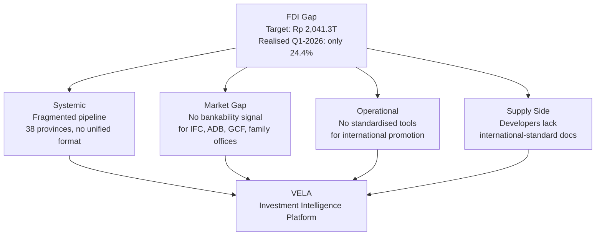

---

## Solution

Integrated platform connecting Indonesia's projects to international capital providers, supported by AI-powered bankability advisory.

### 01 — Investment Marketplace
_Project Listing + Investor Matching_

- Unified national project registry from 38 provinces
- AI bankability score per project (IFC & Moody's standard)
- Top 10 most investment-ready projects ranked by sector
- Secure data room: developer approves each investor access
- Investor matching by sector, ticket size, and DFI criteria

### 02 — AI Bankability Engine
_Bankability Scoring + Project Finance Advisory_

- Project bankability scoring across 6 criteria: permits, offtake, financials, ESG, sponsor, risks
- Gap analysis: actionable steps to raise bankability level (e.g. "Add offtake agreement → score +12 pts")
- AI-based project finance advisor with checklist tool
- Fake project detection and threshold filtering
- Minimum project size filter for international capital targets

### 03 — AI Efficiency Tools
_Project Output Generator_

- One-click standardised pitch deck and teaser per project
- Top 10 portfolio projects deck, filtered by sector/size/readiness
- AI document extraction from any upload format
- Multilingual interface: Bahasa Indonesia, English, Mandarin

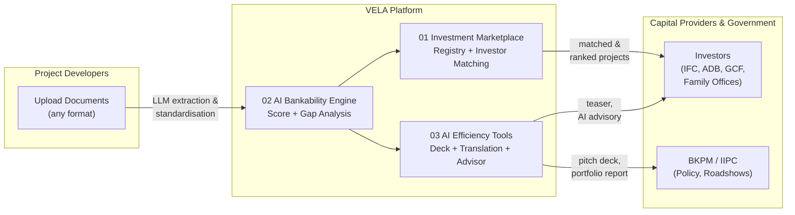

---

## Bankability Rating Framework

Scoring framework derived from IFC Performance Standards and Moody's Project Finance methodology, weighted for Indonesia's infrastructure pipeline.

| Score | Stage | Description |
|-------|-------|-------------|
| 0–49 | **Early Stage** | Foundational criteria unmet. Platform sequences steps toward bankability. |
| 50–69 | **Development Stage** | Structural gaps: regulatory, financial, or ESG. |
| 70–84 | **Pre-Bankable** | 1–2 gaps remain (offtake or permit/license). Target closure within specific period. |
| 85–100 | **Investment Ready** | All risk thresholds cleared. Ready for term sheet with DFIs or PE funds. |

Score of **70** unlocks investor visibility — project becomes discoverable to matched capital providers.

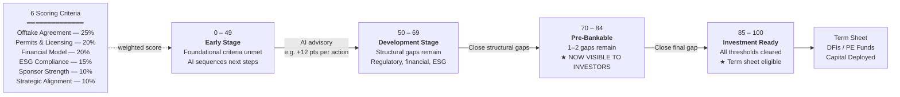

---

## Target Users

### Capital Providers / Investors
- DFIs & multilateral: IFC, ADB, GCF, AIIB
- Institutional: infrastructure funds, pension funds, sovereign wealth
- Private: HNWIs and family offices

**Workflow:** Browse by sector/top-match/readiness → KYC → View bankability score → Request data room → Sign digital MNDA → Developer approves → Access documents

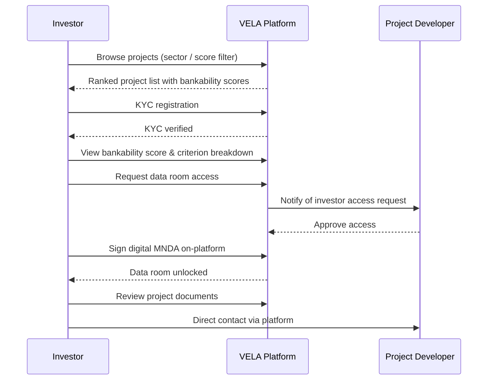

### BKPM / IIPC
- **BKPM Pusat:** national pipeline overview, sectoral analysis, PSN & RPJMN policy alignment
- **IIPC Overseas:** generate Top 10 sector portfolio deck in one click for roadshows
- **DPM-PTSP Provinsi:** submit and manage provincial projects, receive bankability guidance

**Workflow:** Log in → View pipeline → Filter by sector/region → Generate portfolio deck → Share

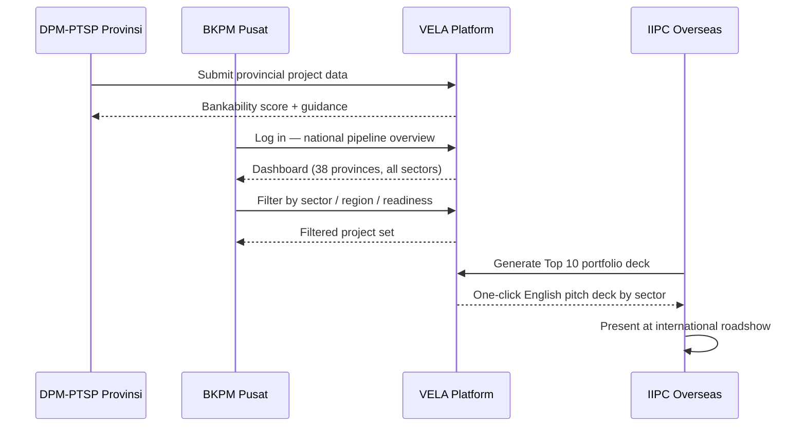

### Project Developers
- Upload any document format → AI extracts, standardises, and auto-populates project profile
- Receive bankability score with improvement advisory
- Manage data room access per investor

**Workflow:** Upload project → AI bankability score → Follow advisory checklist → Improve score → Get contacted by investors

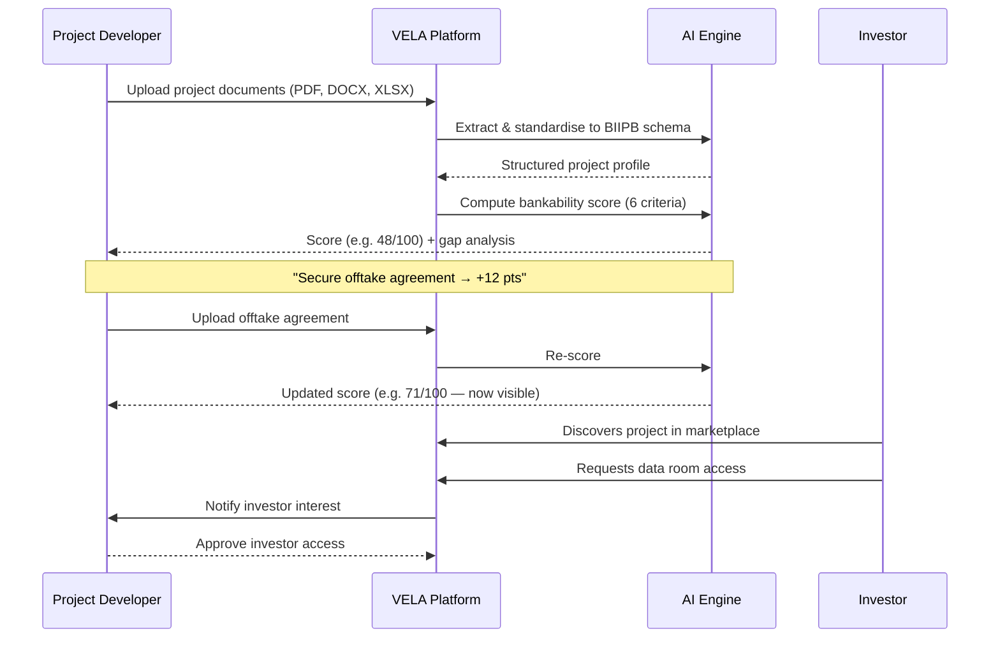

---

## System Architecture

### Input Layer
- Developer upload portal (any doc format)
- BKPM PIR API feed
- Provincial DPM-PTSP web form
- OSS licence data connector
- Investor KYC registration

### AI Engine Layer
- LLM document extraction & NLP
- Data standardisation pipeline (BIIPB schema)
- Bankability scoring (6 criteria)
- Fraud & threshold detection
- Multilingual translation engine
- Investor-project matching algorithm

### Data & Security Layer
- Project registry database
- Secure data room (per project)
- Digital MNDA workflow
- Developer approval gate
- KYC investor verification store

### Output Layer
- Bankability score dashboard
- Top 10 ranked project feed
- English pitch deck generator
- One-page teaser export
- AI project finance advisor
- BKPM portfolio report (1-click)

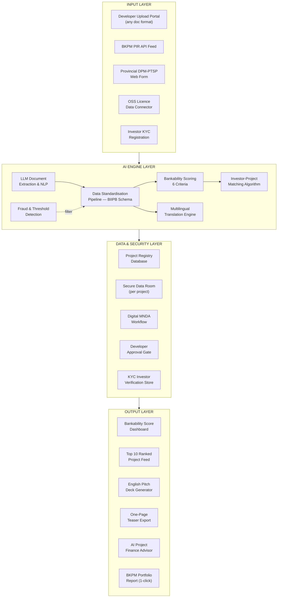

---

## Data Flow

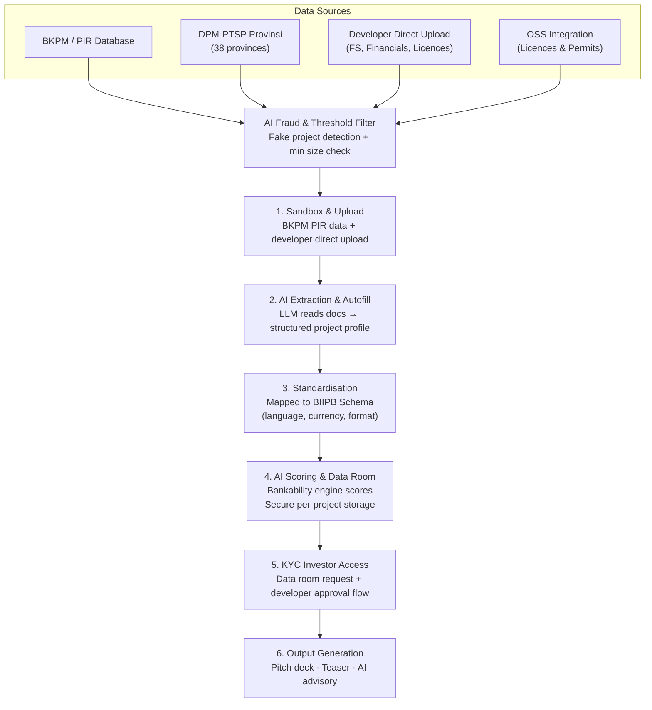

### Data Sources
- **BKPM / PIR Database** — official PIR dataset via incubation sandbox/PIR website
- **DPM-PTSP Provinsi** — 38 provinces, pushed nationally by BKPM
- **Developer Direct Upload** — feasibility studies, financials, licences
- **OSS Integration** — licence & permit cross-reference for regulatory score
- **AI Fraud & Threshold Filter** — fake project detection + minimum project size filter

---

## MVP Delivery Roadmap (8 Weeks)

| Phase | Timeline | Deliverables |
|-------|----------|-------------|
| **Onboarding & Design** | Wk 1 | BKPM PIR data schema analysis, bankability model framework design, data room & MNDA workflow, AWS environment + API architecture |
| **Core Build** | Wk 2–4 | LLM document extraction pipeline, project registry DB + upload portal, scoring engine + fraud detection, KYC investor registration flow |
| **Integration & Features** | Wk 5–6 | BKPM PIR live data integration, investor matching algorithm, pitch deck + teaser generator, BKPM dashboard |
| **Validation & Demo Day** | Wk 7–8 | Real-data pilot with BKPM, MNDA data room end-to-end test, score framework validation, Demo Day + policy adoption brief |

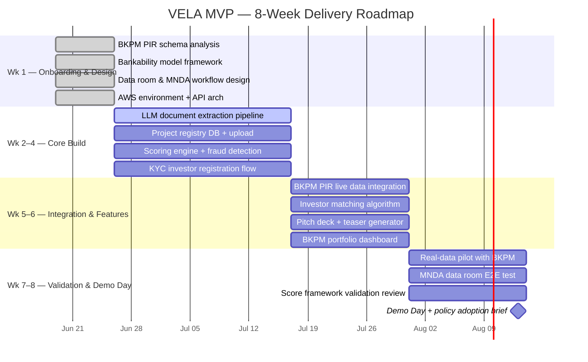

---

## Expected Impact

| Metric | Target |
|--------|--------|
| Provinces covered | 38 |
| Projects scored & listed (Year 1) | 50+ |
| Capital provider institutions | 10+ DFIs, family offices, international lenders |
| DPM-PTSP Provinsi & Kab/Kota | ~552 |
| IIPC Overseas offices | 8 |

### Post-Program Targets
- Formal platform adoption post-incubation
- 38 provincial DPM-PTSP onboarded as data contributors
- 3+ DFI or multilateral institution pilot partnerships
- Integration with OSS or PIR national systems
- Indonesia's first bankability-rated investment project registry live

---

## Risks & Mitigation

| Risk | Level | Mitigation |
|------|-------|------------|
| Scoring credibility | HIGH | Framework aligned with IFC Performance Standards and Moody's; fully transparent per-criterion breakdown; team has project finance background |
| Data quality | MEDIUM | AI autofill bridges gaps; Data Completeness Score distinguishes weak from well-documented; fake project detection + minimum size threshold |
| Data room confidentiality & MNDA enforceability | MEDIUM | Digital MNDA signed on-platform before any access; developer manually approves each investor; legal review during incubation |
| Investor network and onboarding | HIGH | BKPM/IIPC existing institutional relationships (IFC, ADB, GCF, AIIB) as trust bridge; formal endorsement as main channel |

---

## Team

| Role | Name | Background |
|------|------|------------|
| **CEO** | Shinta Hircatanu R | Project Finance · Investment Banking · Cambridge MFin · UNEP-FI · Amazon UK |
| **CTO** | Dede Kurniawan | AI Engineering · Backend · Systems · 7+ yrs fintech/enterprise · Amartha |
| **Domain Lead** | Anabella | Project Finance · Sustainability · Cambridge MFin · IFC · EY · IIPC London ($7.5B+ FDI) |
| **AI/ML Lead** | Vincent Oktavian K | Product · AI Engineering · SaaS · AturKuliner founder (10K+ merchants) |

---

## Current Prototype (Lovable MVP)

> Live: https://invest-vela-id.lovable.app — frontend-only demo built on Lovable (React/Vite), static seed data, no backend.

### Working Routes

| Route | Description |
|-------|-------------|
| `/` | Landing page |
| `/projects` | Investment marketplace |
| `/dashboard` | National pipeline dashboard |
| `/upload` | Project submission + live bankability scorer |

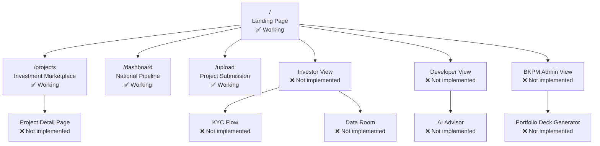

### Landing Page (`/`)

- **Hero:** "Smarter Investments. Faster Decisions" with tagline about bankability index
- **Platform stats:** 247 projects tracked · $48B pipeline value · 38 provinces · 89 investment-ready
- **Problem framing:** "Indonesia's pipeline is opaque" — hundreds of strategic projects without standardised comparison
- **Solution summary:** "One score. Six criteria. Every project" — 0–100 scoring, live diligence tracking, AI summaries
- **Role selection cards:** Investor / Developer / BKPM Admin — each with a "Continue" CTA (sub-routes not yet implemented)
- **Footer:** Identified as "2026 demo build"

### Investment Marketplace (`/projects`)

Filter dimensions:
- **Sector:** Renewable Energy · Infrastructure · Tourism · Agriculture · Water & Sanitation · Digital
- **Province:** Java · Sumatra · Bali · Kalimantan · Sulawesi · Papua
- **Bankability Band:** Investment Ready (85+) · Near Bankable (70–84) · Development (50–69) · Early Stage (<50)

All 14 seed projects currently in the platform:

| # | Project | Sector | Province | Score | Tier | CAPEX |
|---|---------|--------|----------|-------|------|-------|
| 1 | North Java Solar Farm | Renewable Energy | Java | 85 | Investment Ready | $420M |
| 2 | Trans-Sumatra Toll Road Extension | Infrastructure | Sumatra | 85 | Investment Ready | $1,850M |
| 3 | Sulawesi Deep Sea Port | Infrastructure | Sulawesi | 85 | Investment Ready | $1,200M |
| 4 | East Java Geothermal Plant 2×60MW | Renewable Energy | Java | 85 | Investment Ready | $540M |
| 5 | Lombok Airport Expansion | Infrastructure | Bali | 85 | Investment Ready | $670M |
| 6 | Bali Eco-Resort & Marine Park | Tourism | Bali | 79 | Near Bankable | $280M |
| 7 | Kalimantan Palm Oil Processing Hub | Agriculture | Kalimantan | 79 | Near Bankable | $340M |
| 8 | West Java Clean Water SPAM | Water & Sanitation | Java | 74 | Near Bankable | $165M |
| 9 | Sulawesi Integrated Fisheries Port | Agriculture | Sulawesi | 74 | Near Bankable | $380M |
| 10 | Bali Smart Tourism Digital Platform | Digital | Bali | 71 | Near Bankable | $48M |
| 11 | Sumatra Green Hydrogen Plant | Renewable Energy | Sumatra | 68 | Development | $920M |
| 12 | Kalimantan Forest Carbon Credit | Agriculture | Kalimantan | 62 | Development | $210M |
| 13 | Papua Aquaculture Development | Agriculture | Papua | 59 | Development | $95M |
| 14 | North Sumatra EV Battery Factory | Digital | Sumatra | 45 | Early Stage | $1,100M |

Total pipeline: **$8.22B CAPEX** across 14 projects.

### National Pipeline Dashboard (`/dashboard`)

- Summary cards: 14 projects · $8.22B CAPEX · distribution across 4 bankability bands
- Horizontal bar chart: average bankability score by sector
- Top 10 projects table: name · sector · province · score · band · CAPEX
- "View all" link to `/projects`

### Project Submission & Live Scorer (`/upload`)

**Project info form:**

| Field | Type |
|-------|------|
| Project title | Text |
| Sector | Dropdown (6 options) |
| Province | Dropdown (6 regions) |
| Investment value | Numeric (USD millions) |
| Description | Textarea |

**Bankability checklist — 6 criteria with weights:**

| Criterion | Weight | Description |
|-----------|--------|-------------|
| Offtake Agreement | 25% | Long-term buyer commitment |
| Permits & Licensing | 20% | Regulatory readiness |
| Financial Model | 20% | Returns and capital structure |
| ESG Compliance | 15% | Environmental & social safeguards |
| Sponsor Strength | 10% | Track record and credibility |
| Strategic Alignment | 10% | National priority fit |

**Live scoring panel** recalculates in real-time as documents are toggled — default empty state shows 28/100 (Early Stage).

---

### Gap Analysis: Prototype vs. Full Platform

| Feature | Prototype State | MVP Requirement |
|---------|----------------|-----------------|
| Project listing & filters | Done (static data) | Live from BKPM PIR API |
| Bankability score display | Done (static) | AI-computed from uploaded documents |
| National dashboard | Done (static) | Live aggregation |
| Project detail page | Missing | Per-project score breakdown + criteria drill-down |
| Investor role view | Missing (404) | Browse, filter, KYC, data room request |
| Developer role view | Missing (404) | Upload, score tracking, improvement advisory |
| BKPM Admin view | Missing (404) | Pipeline oversight, portfolio deck generator |
| LLM document extraction | Missing | PDF/doc → structured project profile |
| AI bankability advisor | Missing | Gap analysis + ranked improvement actions |
| Secure data room | Missing | Per-project, developer-gated access |
| Digital MNDA workflow | Missing | Sign before data room access |
| KYC investor registration | Missing | Verification store |
| Pitch deck / teaser generator | Missing | One-click English output |
| Multilingual support | Missing | ID / EN / ZH |
| Fraud & threshold detection | Missing | Fake project filter + min size check |
| Investor matching algorithm | Missing | Sector × ticket size × DFI criteria |
| BKPM PIR API integration | Missing | Live data feed |
| OSS licence connector | Missing | Cross-reference for regulatory score |
| Auth / access control | Missing | Role-based (Investor / Developer / Admin) |
| Backend & database | Missing | Full API + project registry |

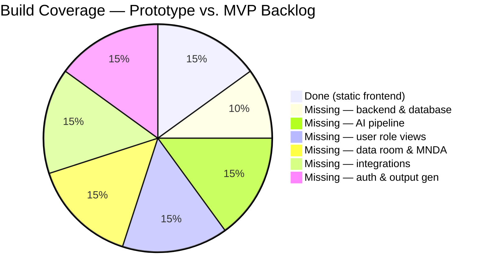

---

## Tech Stack (Planned)

- **Infrastructure:** AWS
- **AI/ML:** LLM-based document extraction, NLP, scoring engine, matching algorithm
- **Backend:** API-first architecture
- **Database:** Project registry + secure document store
- **Auth/KYC:** Investor verification + digital MNDA workflow
